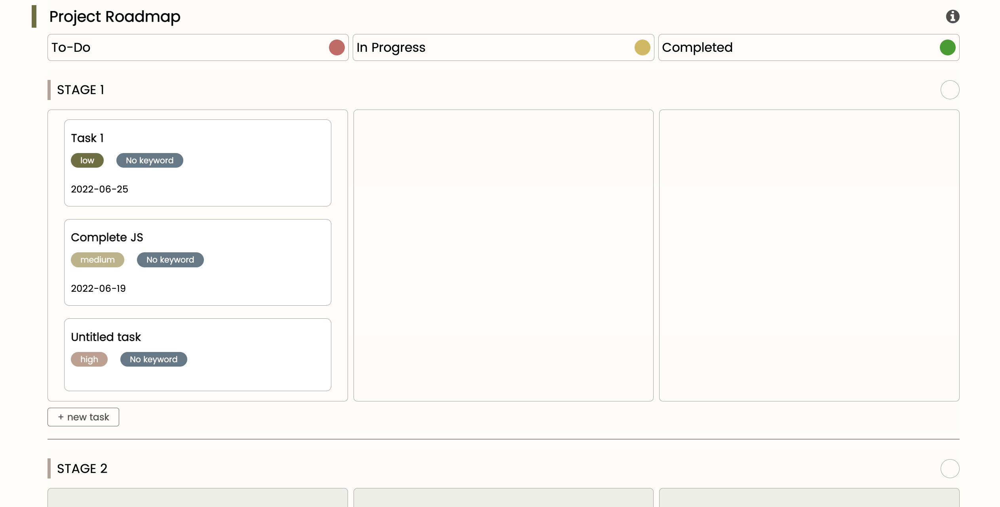
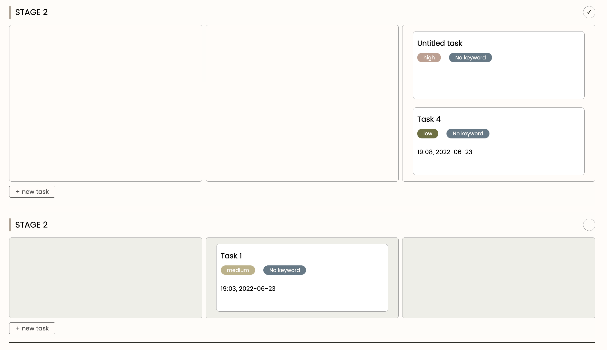

# StudBud
DECO2017 A3

**Introduction To StudBud**

StudBud is a study web app that helps students to manage and plan out the operation of project assignments in school. It is equipped with functions: Pomodoro timer, embedded lofi music player, and resource list to create an engaging and fun learning experience.

**Pomodoro Timer**

Pomodoro timer allows users to customise the number of rounds, break time and study time to adapt their personal learning habits. The timer is located in the nav bar to allow access anywhere on the web app.

Pomodoro timer is inspired and modified from the youtube source https://www.youtube.com/watch?v=x7WJEmxNlEs This source only provided the logic of how to create a basic customisable timer.

**Music Player**

The music player contains 100 lofi songs retrieved from Spotify to create a relaxing and chill learning atmosphere. The web app only provides lofi because it is less disturbing and more comforting to listen to while studying.

**Resource List**

A resource list allows users to add valid links to the page, and tags can be created for each resource. Users can also write a summary, and save all contents by pressing the save button.

**Project Management**

On this web app, users can create projects, assignment objectives and tasks for each project. The project page is templated to guide users to segment their big project into smaller chunks, which are categorised by stages. Within each stage of the project, users can create tasks with attributes: due date, estimated completion time, priority, tasks name, and keyword. Users can drag tasks to the corresponding completion status according to their own pace.

Drag and drop event lister is following tutorial the https://www.youtube.com/watch?v=tZ45HZAkbLc&t=1218s (See more in reference).

**Comparison between proposed and final design**

1. Feedback in A3 suggested that the web app needs to guide people to use the roadmap more carefully, so they feel overwhelmed. An info button is added at the roadmap corner to introduce people to how to use the roadmap adequately. 

2. Priority tags are colour coded to be better and more easily differentiated. People can spot the priority difference by colour perception, without looking through a large task list to find the ones that are high priority. 

3. To provide a clear roadmap method, users can now mark stages as done according to their progression. Seeing which stages were completed can visualise the progression and know where they are at. Combining this function with expandable stages, users can just focus on one stage and feel less stressed as the other stages are not visible at that moment. 

4. A motivational quote section is added to each project page so they feel more inspired. 

5. Only one tag can be added to the resource in the proposed design. Now multiple tags can be added to support note-taking on the web.

**Possible Further Improvements (Reflection)**

Code perspective
1. Tasks in each stage should be added to local storage to make this web app actually function. 

2. Pomodoro timer being able to run across the site.

3. Enable auto save on the resource page.

Design perspective
1. Be more customisable. Different types of students should be provided with a template to start with. For example, computer science students can use a pre-set template designed for coding projects, and design students should be provided with a design project template.

**References**

Florin P. Simple Countdown Timer with JavaScript. Retrieve from: https://www.youtube.com/watch?v=x7WJEmxNlEs

Font Awesome Icons. Retrieve from: https://fontawesome.com/v4/

FreeCodeCamp. Inspirational Quote API. Retrieve from: https://forum.freecodecamp.org/t/free-api-inspirational-quotes-json-with-code-examples/311373

Linkpreview. Generate URL preview API. Retrieve from: https://my.linkpreview.net/

Spotify. lofi hip hop music - beats to relax/study to. Retrieved from: https://open.spotify.com/playlist/0vvXsWCC9xrXsKd4FyS8kM?go=1&sp_cid=a4365024-4b53-4dce-90a4-aca70d78cb4f&utm_source=embed_player_m&utm_medium=desktop&nd=1

StackOverflow. Find button clicked within a list. Retrieve from: https://stackoverflow.com/questions/43075457/javascript-find-the-index-of-clicked-button

Tyler P. Easy Drag n Drop with JavaScript - hot ro code tutorial. Drag and drop events. Retrieved from: https://www.youtube.com/watch?v=tZ45HZAkbLc&t=1218s